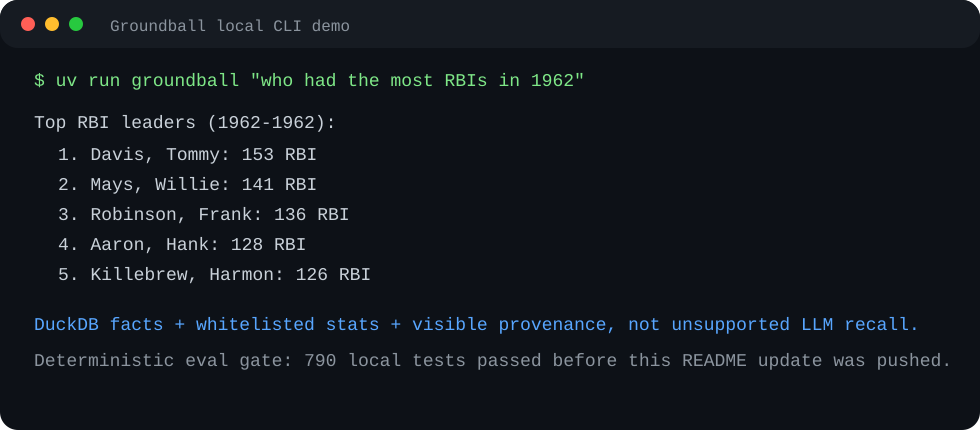

# Groundball: A Modern Sports Almanac With Audit-Ready Provenance

[](https://github.com/DiscoStew6082/groundball/actions/workflows/ci.yml)

Groundball is a local-first modern sports almanac for MLB history: natural-language questions in, grounded answers with stats, context, and audit-ready evidence out.

## 30-second proof

- **Problem:** classic sports almanacs are trusted but static; general-purpose LLMs are flexible but can confidently hallucinate baseball stats, player identities, old team names, and year ranges.
- **System:** a modern almanac engine routes structured questions to DuckDB, uses a local LLM only where prose is appropriate, and returns the rows, SQL, checksums, dataset license metadata, and verification results behind each answer.
- **Safety boundary:** stat SQL is generated from a whitelist and typed query specs; ambiguous, live, future, or unsupported questions fail closed instead of guessing.
- **Proof:** deterministic eval gates run in CI, publish Markdown/JSON evidence, compare against a baseline, and expose release-blocking guardrail coverage.
- **Stack:** Python, FastAPI, DuckDB, Typer, Gradio, pytest, local/open-weight LLM workflow.

**Recruiter signal:** this is not a chatbot wrapper. It is a modern sports almanac system focused on grounded generation, provenance, deterministic release gates, and operational failure modes.



## What it does

Groundball is built like a modern sports almanac: it combines historical MLB stat tables, player identity resolution, local stat definitions, selective LLM narration, and visible provenance behind one natural-language interface.

It routes questions to grounded sources, answers structured questions from DuckDB, uses the local LLM only where prose is appropriate, and returns provenance with the rows, SQL, checksums, dataset license metadata, and verification results used to support the answer.

The interesting part is not that an LLM can sound fluent about baseball, but that the system prevents unsupported stat claims, constrains where facts come from, gates releases with deterministic evals, and leaves audit-ready evidence for review.

## Problem

Baseball questions mix structured analytics and fuzzy language:

- "who had the most RBIs in 1962"
- "how many HRs did Ronald Acuna Jr. have in 2023"
- "who played for the Braves in 1936"
- "what is OPS"
- "who was Babe Ruth"

A general-purpose model can make those questions sound easy even when it has the numbers wrong. Stat totals, old team names, player identities, and year ranges are exactly the kind of details a model will confidently hallucinate unless the answer is forced through authoritative data and visible checks. A pure SQL interface is brittle for nontechnical users. Groundball sits between them: language in, typed routing and whitelisted SQL in the middle, grounded answer plus evidence out.

## Architecture

```text
Question
  |
  v
Router
  |-- stat_query ------> DuckDB over NeuML/baseballdata CSVs
  |-- grounded_database_question --> typed query spec -> parameterized SQL -> DuckDB
  |-- player_bio ------> DuckDB identity -> LLM JSON bio -> Lahman/Retrosheet claim consensus
  |-- explanation -----> local stat definitions, then LLM open explanation
  |
  v
StructuredAnswer(answer, intent, sources, warnings, unsupported)
```

Key choices:

- DuckDB is the source of truth for structured stats.
- `src/baseball_rag/db/stat_registry.py` is the only stat whitelist used by SQL builders.
- Grounded database questions keep the intent-to-SQL idea, but the model only returns a typed query spec. Python assembles parameterized SQL.
- Every DuckDB source includes `data/manifest.json` provenance: source URL, files, row counts, year coverage, checksums, download time, license notes, and a `source_authorities` catalog that keeps Lahman primary. Biography consensus payloads add Retrosheet as optional secondary evidence.
- Player biographies are generated by the local LLM after the player identity resolves through DuckDB. Extractable supported stat claims are checked against DuckDB/Lahman and optional Retrosheet consensus evidence for biography stat claims before the answer is returned.
- Stat definition questions such as "what is OPS?" use checked-in local stat definitions first; broader baseball explanations use the local LLM.
- ChromaDB was removed because it duplicated generated facts and added fragile local state. DuckDB remains the source of truth for structured baseball facts.
- CI runs a deterministic-only AI release gate with Markdown/JSON artifacts and baseline comparison. Live LLM evals stay optional local commands.
- API responses include audit metadata for route, unsupported status, SQL template hash, source summaries, latency, dataset/model versions, and exact eval-manifest matches when the manifest is available.
- Unsupported or ambiguous API answers are written to a small JSONL human-review queue.

## API Example

Start the server:

```bash
uv run uvicorn baseball_rag.api.server:app --reload
```

Ask a question:

```bash
curl -s http://127.0.0.1:8000/query \
  -H 'content-type: application/json' \
  -d '{"question":"who had the most RBIs in 1962"}'
```

Response shape:

```json
{
  "answer": "Top RBI leaders (1962-1962):\n  1. Davis, Tommy: 153 RBI\n  ...",
  "intent": "stat_query",
  "sources": [
    {
      "type": "duckdb",
      "label": "RBI leaderboard for 1962-1962",
      "rows": [{ "name": "Davis, Tommy", "team": "Range", "stat_value": 153 }],
      "sql": "SELECT ... WHERE b.yearID >= ? AND b.yearID <= ? ...",
      "data_manifest": {
        "dataset": { "name": "NeuML/baseballdata", "license": "CC BY-SA 3.0" },
        "coverage": { "structured_stat_years": { "min": 1871, "max": 2025 } }
      }
    }
  ],
  "warnings": [],
  "unsupported": false,
  "metadata": {
    "query_id": "q_0c9ab4d71dfcb6ec",
    "route": "stat_query",
    "unsupported": false,
    "unsupported_reason": null,
    "sql_visible": true,
    "sql": {
      "template_hash": "sql_3f0c8e2cc6d1a8bb",
      "parameterized": true,
      "row_count": 10
    },
    "source_count": 1,
    "latency_ms": 8.4
  },
  "review": null
}
```

Dataset provenance is also available directly:

```bash
curl -s http://127.0.0.1:8000/sources
```

## CLI And UI

CLI:

```bash
uv run groundball "career home run leaders"
uv run groundball "who was Babe Ruth"
```

Gradio UI:

```bash
uv run groundball-ui
```

The short UI command binds to `127.0.0.1:7861` and runs until you stop it with
Ctrl-C. Add a TTL only for short smoke tests where you want the process to exit
automatically:

```bash
uv run groundball-ui --ttl-seconds 300
```

You can also set `GROUNDBALL_WEB_APP_TTL_SECONDS`; `BASEBALL_RAG_WEB_APP_TTL_SECONDS` remains a compatibility alias. `0` or an unset value disables
the TTL.

The UI shows the answer, evidence table, source JSON, and SQL for query paths that generate SQL.

## Website Integration

The public blog integration keeps `https://discostew.dev` on Cloudflare Pages
and uses a same-origin Pages Function at `/groundball/query` to call
`https://groundball.discostew.dev/query` through Cloudflare Tunnel. The browser
does not need a Cloudflare Access sign-in link; any Tunnel Access service token
or origin proxy token stays in Pages Function secrets. The Pages Function also
requires `GROUNDBALL_ALLOWED_IPS` so the automatic private demo only forwards
from Stewart's current public IPs.

Use Gemma 4 12B for the hosted local-model profile:

```bash
export LMSTUDIO_BASE_URL=http://localhost:1234/v1
export LMSTUDIO_MODEL=unsloth/gemma-4-12b-it
export GROUNDBALL_CORS_ORIGINS=https://discostew.dev,http://localhost:4321,http://127.0.0.1:4321
export GROUNDBALL_ORIGIN_PROXY_TOKEN=<shared Pages Function secret>
uv run uvicorn baseball_rag.api.server:app --host 127.0.0.1 --port 8000
```

When `GROUNDBALL_ORIGIN_PROXY_TOKEN` is set, direct Tunnel callers must send
`X-Groundball-Proxy-Token`; the blog's Pages Function adds that header
server-side so the browser path remains automatic.

See [docs/cloudflare-tunnel.md](docs/cloudflare-tunnel.md) for the Tunnel,
Pages Function, Access service-token, and smoke-test runbook.

## Try These Questions

These make a compact demo script for the CLI, API, or Gradio UI:

- "who had the most RBIs in 1962" - deterministic stat query from DuckDB.
- "who won the Triple Crown and which years" - deterministic grounded database template with a visible provenance badge.
- "who played for the Braves in 1936" - typed grounded database question using parameterized SQL.
- "who played for the Dodgers in 1947" - historical roster query with old team names handled through the database.
- "who was Babe Ruth" - LLM-generated player biography with DuckDB identity and stat-claim verification.
- "what is OPS" - local stat-definition explanation with stat-definition provenance.
- "how many home runs did Williams have in 1941" - ambiguity should fail closed instead of guessing Ted Williams.
- "who played for the Yankees in 1950" - inspect the returned SQL, rows, source manifest, and checksums.
- "what is the Yankees score right now" - unsupported because this is historical data, not a live scoreboard.

## Data Provenance

The structured dataset is [`NeuML/baseballdata`](https://huggingface.co/datasets/NeuML/baseballdata), a copy of the Lahman Baseball Database. The local manifest records:

- CSV files: `Batting.csv`, `Fielding.csv`, `People.csv`, `Pitching.csv`
- Row counts: 128,598 batting, 174,332 fielding, 24,270 people, 57,630 pitching
- Year coverage: 1871-2025 for structured stat tables
- SHA-256 checksums for reproducibility
- Download time: `2026-04-20T13:29:00-04:00`
- License: CC BY-SA 3.0 per Hugging Face metadata

See [data/manifest.json](data/manifest.json).

Generated data policy:

- `data/manifest.json` is tracked because it documents the data contract.
- `data/*.csv` is downloaded on demand.
- `data/*.duckdb` files are generated local state and are not tracked.
- `data/secondary_sources/retrosheet/manifest.json` documents optional Retrosheet secondary evidence when local consensus data exists.
- Checked-in stat-definition Markdown under `src/baseball_rag/corpus/stat_definitions/` is runtime grounding for supported stat-definition explanations.

Populate structured data and regenerate the manifest:

```bash
uv run python -m baseball_rag.db.download
```

## Evaluation

The golden eval set lives in [evals/questions.yaml](evals/questions.yaml). CI treats the deterministic subset as an AI release gate. The gate emits Markdown and JSON artifacts, compares against [evals/baseline.json](evals/baseline.json), and returns `PASS`, `WARN`, or `BLOCK`.

The eval manifest covers:

- known stat answers and row-count expectations
- grounded database typed-query cases
- SQL visibility and parameterization checks
- unsupported live/future/non-baseball questions
- ambiguous player names
- minimum sample size cases for AVG and ERA
- source manifest requirements

Run the deterministic release gate locally:

```bash
uv run python -m evals.questions --report docs/eval-report.md --guardrail-report docs/guardrail-coverage.md --json-report docs/eval-report.json --baseline evals/baseline.json
```

Artifacts:

- [docs/eval-report.md](docs/eval-report.md) gives an executive-friendly release summary with pass rate, skipped live cases, risk categories, service requirements, and release recommendation.
- [docs/eval-report.json](docs/eval-report.json) is the machine-readable artifact for CI and baseline review.
- [docs/guardrail-coverage.md](docs/guardrail-coverage.md) presents unsupported-case, SQL safety, provenance, and live/manual coverage as intentional safety controls.

Current automated tests:

```bash
uv run pytest -q
```

Live LLM-assisted evals remain opt-in local/manual commands and do not block CI.

## Governance API

The FastAPI app exposes deterministic governance surfaces alongside `/query`:

- `GET /evals/report` runs the deterministic eval gate and returns JSON plus Markdown without writing docs files.
- `POST /evals/run` runs the deterministic gate by default; `include_live=true` opts into cases that may require LM Studio.
- `GET /guardrails/coverage` returns manifest-only guardrail coverage through the package-safe eval manifest adapter, with no DB or LLM dependency. In a package-only runtime where the repo manifest is absent, it returns explicit unavailable metadata instead of importing repo-only eval code.
- `GET /health/verification` returns operational readiness for the primary manifest, DuckDB core tables, guardrail manifest, and standard verification commands.
- `GET /review-queue` and `PATCH /review-queue/{item_id}` expose the local human-review queue for unsupported or ambiguous API answers.

See [docs/api.md](docs/api.md) for request and response details.

## Why Not Just Ask ChatGPT?

The point is deterministic execution, not smarter-sounding baseball prose. Groundball exists because models routinely hallucinate actual baseball stats: the exact leader, total, year, team, or player identity can be wrong while the answer still reads confidently. The LLM classifies intent and narrates grounded results; DuckDB executes the structured stat work. Grounded database questions become typed specs, then Python builds parameterized/template SQL instead of trusting model-written SQL. Player biographies are generated by the LLM, but the player identity must resolve through DuckDB first and supported stat claims are verified against DuckDB/Lahman plus optional Retrosheet consensus evidence. Responses expose SQL where available, result rows, verification rows, and the data manifest with checksums and license metadata. Ambiguous or unsupported questions fail closed, enter the human-review queue when they arrive through the API, and the eval gate protects common baseball-history claims, SQL visibility, source provenance, minimum-sample rules, and live-data limitations from drifting.

## Why This Is Grounded

Grounding is enforced in several places:

- The router returns structured intent instead of prose.
- Stat SQL only accepts registered stats; unsupported stats raise instead of falling through to raw column names.
- Grounded database SQL uses typed specs and bound parameters for model-supplied values.
- DuckDB sources include rows and dataset manifest metadata.
- Player biographies fail closed before generation when the player name is ambiguous or unresolved.
- Biography stat claims that can be extracted and matched to registered stats are verified against DuckDB/Lahman and optional Retrosheet consensus evidence; mismatches return the prose plus structured and visible warnings.
- If LM Studio is unavailable for player biographies or open explanations, the system returns `llm_unavailable` without inventing LLM prose or DuckDB-only biography text.

## Limitations

- This is historical data, not a live MLB scoreboard, injury feed, betting model, salary database, or Statcast warehouse.
- Some grounded database questions still depend on the local intent model producing a supported typed spec.
- Open explanations and biography prose depend on LM Studio availability.
- Lahman-style historical data can encode old team IDs and historical naming conventions that require careful interpretation.

## Development

```bash
uv sync
uv run python -m baseball_rag.db.download
uv run pytest -q
```

Useful docs:

- [API reference](docs/api.md)
- [Architecture notes](docs/architecture.md)
- [CLI notes](docs/cli.md)
- [Demo checklist](docs/demo-checklist.md)
- [Five-minute AI governance demo](docs/demo-governance.md)

## License

Groundball's code is released under the [MIT License](LICENSE). Dataset licenses remain governed by their upstream sources; see [data/manifest.json](data/manifest.json) for source, checksum, coverage, and license metadata.
